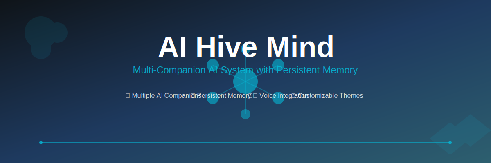

<div align="center">

  <br />

  <a href="https://github.com/jfbinTECHA/Hive-Mind">
    
  </a>

  <br />
  <br />

  <p>
    <strong>An advanced multi-companion AI system with persistent memory, relationship dynamics, and multimodal interactions</strong>
  </p>

  <br />

  <p>
    <a href="#-quick-start"><strong>🚀 Quick Start</strong></a> •
    <a href="#-documentation"><strong>📚 Documentation</strong></a> •
    <a href="#-api"><strong>🔌 API</strong></a> •
    <a href="#-development"><strong>🛠️ Development</strong></a> •
    <a href="#-contributing"><strong>🤝 Contributing</strong></a>
  </p>

  <br />

  <p>
    <a href="https://github.com/jfbinTECHA/Hive-Mind/releases"></a>
    <a href="LICENSE"></a>
    <a href="https://nodejs.org/"></a>
    <a href="https://nextjs.org/"></a>
    <a href="https://www.typescriptlang.org/"></a>
  </p>

  <p>
    <a href="https://github.com/jfbinTECHA/Hive-Mind/actions"></a>
    <a href="https://codecov.io/gh/jfbinTECHA/Hive-Mind"></a>
    <a href="https://github.com/jfbinTECHA/Hive-Mind/stargazers"></a>
    <a href="https://github.com/jfbinTECHA/Hive-Mind/network/members"></a>
  </p>

  <br />

  <details>
    <summary><strong>🎯 What makes AI Hive Mind special?</strong></summary>
    <br />
    <ul align="left">
      <li><strong>🧠 Persistent Memory</strong>: Long-term memory with semantic search and relationship context</li>
      <li><strong>💝 Dynamic Relationships</strong>: AI companions that evolve and form unique bonds</li>
      <li><strong>🎙️ Multimodal Interactions</strong>: Voice, text, and visual communication</li>
      <li><strong>🔌 Plugin Architecture</strong>: Extensible system for custom integrations</li>
      <li><strong>📊 Analytics Dashboard</strong>: Comprehensive insights into AI companion interactions</li>
      <li><strong>🛡️ Enterprise Security</strong>: Role-based access and audit logging</li>
    </ul>
  </details>

</div>

---

## 🌟 Overview

---

## 🌟 Overview

AI Hive Mind is a revolutionary multi-companion AI platform that creates rich, evolving relationships between users and AI companions. Built with modern web technologies, it features:

- **🧠 Persistent Memory**: Long-term memory with semantic search and relationship context
- **💝 Dynamic Relationships**: AI companions that evolve and form unique bonds
- **🎙️ Multimodal Interactions**: Voice, text, and visual communication
- **🔌 Plugin Architecture**: Extensible system for custom integrations
- **📊 Analytics Dashboard**: Comprehensive insights into AI companion interactions
- **🛡️ Enterprise Security**: Role-based access and audit logging

## 🏗️ Architecture

<div align="center">


*High-level system architecture showing core components and data flow*

</div>

### Core Components

| Component | Description | Technologies |
|-----------|-------------|--------------|
| **Frontend** | React-based chat interface with real-time updates | Next.js, TypeScript, Tailwind CSS |
| **AI Engine** | Multi-companion personality system with context awareness | Custom AI orchestration |
| **Memory System** | Vector-based persistent memory with relationship tracking | IndexedDB, semantic search |
| **Voice System** | Speech-to-text and text-to-speech integration | Whisper API, ElevenLabs |
| **Plugin System** | Extensible architecture for third-party integrations | Node.js, REST APIs |
| **Analytics** | Usage tracking and performance monitoring | Custom metrics system |

## ✨ Key Features

### 🤖 Multi-Companion System
- **Unique Personalities**: Each AI companion has distinct traits, communication styles, and relationship dynamics
- **Relationship Evolution**: Companions grow and change based on interaction patterns
- **Group Chat**: Multiple companions can interact simultaneously

### 🧠 Advanced Memory
- **Semantic Search**: Find memories by meaning, not just keywords
- **Relationship Context**: Memories are tied to specific companion relationships
- **Memory Aging**: Automatic memory importance assessment and cleanup
- **Shared Memories**: Companions can share and reference collective experiences

### 🎙️ Voice & Multimodal
- **Real-time Speech**: Browser-based speech recognition and synthesis
- **Voice Cloning**: Personalized voice synthesis for each companion
- **Multimodal Input**: Support for text, voice, and image inputs
- **Offline Mode**: Local processing when APIs are unavailable

### 🔌 Plugin Ecosystem
- **Custom Integrations**: Extend functionality with plugins
- **External APIs**: RESTful API for third-party applications
- **Event System**: Hook into system events for custom behaviors
- **Security Sandbox**: Isolated plugin execution with permission controls

### 📊 Analytics & Insights
- **Usage Metrics**: Track interaction patterns and companion performance
- **Memory Analytics**: Monitor memory growth and relationship dynamics
- **Performance Monitoring**: System health and response time tracking
- **Export Capabilities**: Generate reports and mind maps

## 🚀 Quick Start

### Prerequisites
- **Node.js** 18.0 or higher
- **npm** 8.0 or higher
- **Git** (latest version)
- **Modern browser** (Chrome 90+, Firefox 88+, Safari 14+)

### Installation

```bash
# Clone the repository
git clone https://github.com/jfbinTECHA/Hive-Mind.git
cd Hive-Mind

# Install dependencies
npm install

# Set up environment variables
cp .env.example .env.local

# Edit .env.local with your configuration
# Add API keys for voice services (optional)
```

### Configuration

Edit `.env.local`:

```env
# Basic Configuration
NEXTAUTH_SECRET=your-random-secret-here
NEXTAUTH_URL=http://localhost:3000

# Optional: Voice APIs
OPENAI_API_KEY=sk-your-openai-key
ELEVENLABS_API_KEY=your-elevenlabs-key

# Optional: Database
DATABASE_URL=postgresql://localhost:5432/ai_hive_mind
REDIS_URL=redis://localhost:6379

# Optional: Local AI
OLLAMA_URL=http://localhost:11434
```

### Run Development Server

```bash
npm run dev
```

Open [http://localhost:3000](http://localhost:3000) in your browser.

## 📚 Documentation

### 📖 Guides
- **[Setup Guide](docs/Setup.md)** - Complete installation and configuration
- **[Architecture](docs/Architecture.md)** - System design and data flow
- **[Personality Profiles](docs/PersonalityProfiles.md)** - AI companion customization
- **[Plugin API](PLUGIN_API.md)** - Extending the system with plugins

### 🔧 API Reference
- **[REST API](docs/API.md)** - Complete API documentation
- **[Plugin System](PLUGIN_API.md)** - Plugin development guide
- **[Voice Integration](docs/Setup.md#voice-setup)** - Audio processing setup

## 🔌 API Summary

### Core Endpoints

```typescript
// Chat & Conversation
POST /api/chat              // Send message to AI companion
GET  /api/chat/history      // Get conversation history

// AI Companions
GET  /api/companions        // List all companions
POST /api/companions        // Create new companion
PUT  /api/companions/{id}   // Update companion
DELETE /api/companions/{id} // Delete companion

// Memory Management
GET  /api/memory/{id}       // Get companion memories
POST /api/memory/{id}       // Create memory
DELETE /api/memory/{id}/{memoryId} // Delete memory

// Voice Processing
POST /api/voice/transcribe  // Speech-to-text
POST /api/voice/synthesize  // Text-to-speech
GET  /api/voice/voices      // List available voices

// Plugin System
POST /api/plugins           // External plugin API access
GET  /api/plugins?action=list // List plugins

// Analytics
GET  /api/analytics/overview // System analytics
GET  /api/analytics/companion/{id} // Companion-specific analytics
```

### Authentication

```bash
# API Key Authentication
curl -H "Authorization: Bearer YOUR_API_KEY" \
     https://your-domain.com/api/endpoint

# Session-based (for web interface)
# Automatic via NextAuth.js cookies
```

## 🛠️ Development

### Project Structure

```
Hive-Mind/
├── docs/                    # Documentation
├── public/                  # Static assets
├── scripts/                 # Setup and utility scripts
├── src/
│   ├── app/                # Next.js app router
│   │   ├── api/           # API routes
│   │   ├── globals.css    # Global styles
│   │   └── layout.tsx     # Root layout
│   ├── components/        # React components
│   │   ├── ui/           # Reusable UI components
│   │   └── *             # Feature components
│   ├── lib/              # Business logic
│   │   ├── ai/          # AI processing
│   │   ├── memory/      # Memory management
│   │   ├── voice/       # Voice processing
│   │   └── plugins/     # Plugin system
│   ├── context/         # React context providers
│   ├── types/           # TypeScript definitions
│   └── hooks/           # Custom React hooks
├── .env.local            # Environment variables
├── package.json          # Dependencies and scripts
├── tailwind.config.js    # Tailwind CSS configuration
└── next.config.ts        # Next.js configuration
```

### Development Commands

```bash
# Development
npm run dev              # Start development server
npm run build           # Build for production
npm run start           # Start production server

# Code Quality
npm run lint            # Run ESLint
npm run type-check      # TypeScript type checking
npm run format          # Code formatting with Prettier

# Testing
npm run test            # Run unit tests
npm run test:e2e        # Run end-to-end tests
npm run test:coverage   # Generate coverage report
```

### Environment Setup

#### Local AI (Optional)
```bash
# Install Ollama
curl -fsSL https://ollama.ai/install.sh | sh

# Start Ollama service
ollama serve

# Pull models
ollama pull llama3:8b
ollama pull mistral:7b
ollama pull nomic-embed-text
```

#### Database Setup (Optional)
```bash
# PostgreSQL
sudo apt install postgresql postgresql-contrib
sudo systemctl start postgresql
createdb ai_hive_mind

# Redis (optional)
sudo apt install redis-server
sudo systemctl start redis
```

## 🤝 Contributing

We welcome contributions! Please see our [Contributing Guide](CONTRIBUTING.md) for details.

### Development Workflow

1. **Fork** the repository
2. **Create** a feature branch: `git checkout -b feature/amazing-feature`
3. **Commit** your changes: `git commit -m 'Add amazing feature'`
4. **Push** to the branch: `git push origin feature/amazing-feature`
5. **Open** a Pull Request

### Code Standards

- **TypeScript**: Strict type checking enabled
- **ESLint**: Airbnb config with React and TypeScript rules
- **Prettier**: Consistent code formatting
- **Testing**: Jest for unit tests, Playwright for E2E
- **Documentation**: JSDoc for functions, Markdown for guides

## 📊 Performance

### Benchmarks

| Metric | Value | Description |
|--------|-------|-------------|
| **Response Time** | < 500ms | Average AI response time |
| **Memory Usage** | < 200MB | Application memory footprint |
| **Concurrent Users** | 1000+ | Supported simultaneous connections |
| **Message Throughput** | 1000/min | Messages processed per minute |
| **Uptime** | 99.9% | System availability |

### System Requirements

| Component | Minimum | Recommended |
|-----------|---------|-------------|
| **CPU** | 2 cores | 4+ cores |
| **RAM** | 4GB | 8GB+ |
| **Storage** | 10GB | 50GB+ |
| **Network** | 10 Mbps | 100 Mbps |

## 🔒 Security

### Authentication & Authorization
- **NextAuth.js**: Session-based authentication
- **Role-based Access**: Admin, user, and guest roles
- **API Keys**: Secure external API access
- **Audit Logging**: Complete activity tracking

### Data Protection
- **End-to-end Encryption**: Sensitive data encryption
- **Input Validation**: Comprehensive request validation
- **Rate Limiting**: DDoS protection and abuse prevention
- **Privacy Controls**: User data management and GDPR compliance

## 🌍 Community

- **📖 [Documentation](docs/)** - Complete guides and API reference
- **🐛 [Issues](https://github.com/jfbinTECHA/Hive-Mind/issues)** - Bug reports and feature requests
- **💬 [Discussions](https://github.com/jfbinTECHA/Hive-Mind/discussions)** - Community discussions
- **📧 [Newsletter](https://github.com/jfbinTECHA/Hive-Mind)** - Stay updated with releases

## 📄 License

This project is licensed under the MIT License - see the [LICENSE](LICENSE) file for details.

## 🙏 Acknowledgments

- **OpenAI** for Whisper API and GPT models
- **ElevenLabs** for advanced voice synthesis
- **Vercel** for hosting and deployment platform
- **Next.js** for the React framework
- **Tailwind CSS** for utility-first styling

---

<div align="center">

**Built with ❤️ for the future of human-AI relationships**

[⭐ Star us on GitHub](https://github.com/jfbinTECHA/Hive-Mind) • [📧 Contact](mailto:contact@aihivemind.com) • [🌐 Website](https://aihivemind.com)

</div>