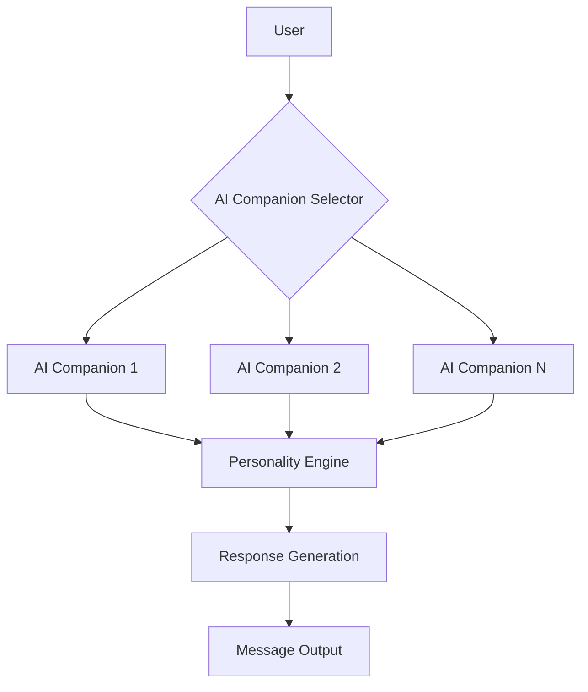
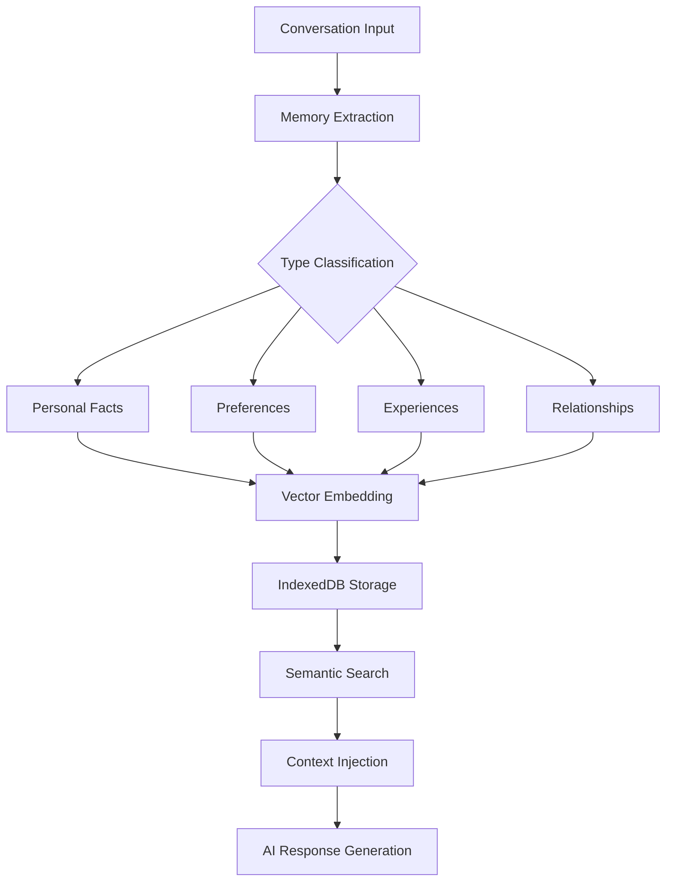
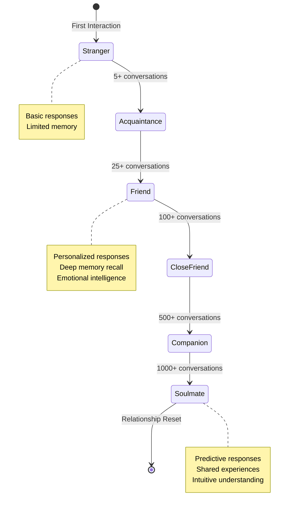
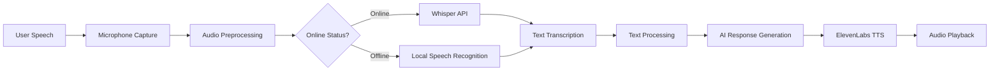
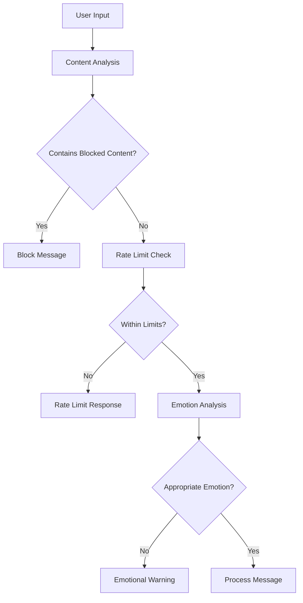
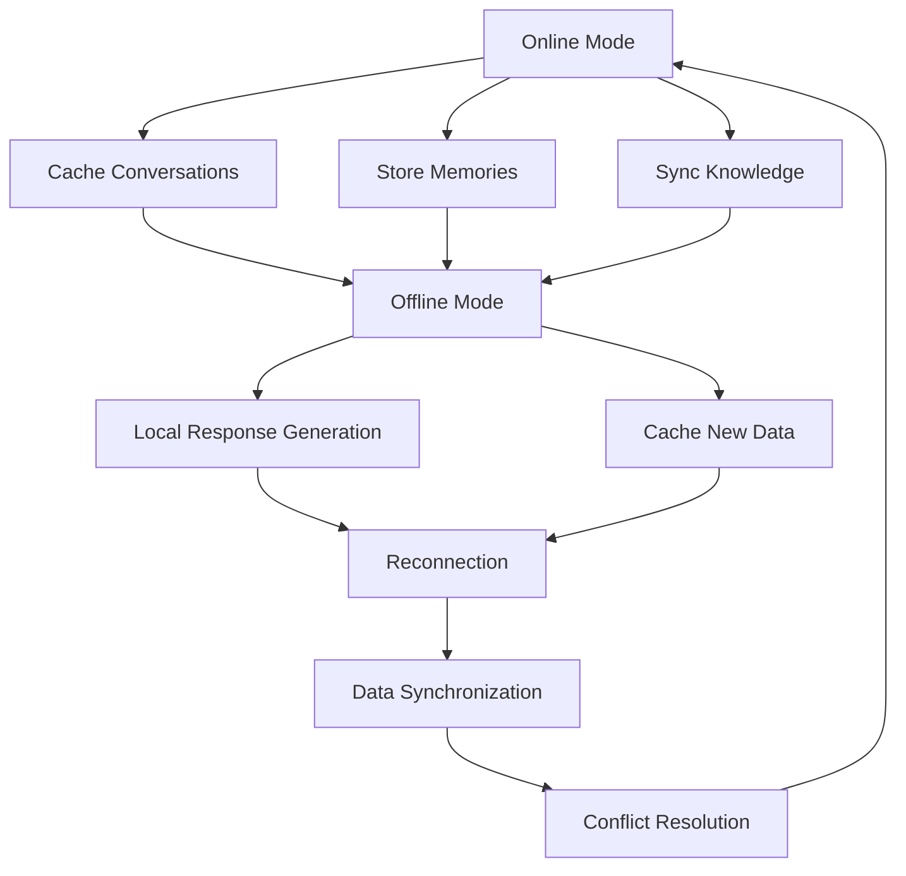
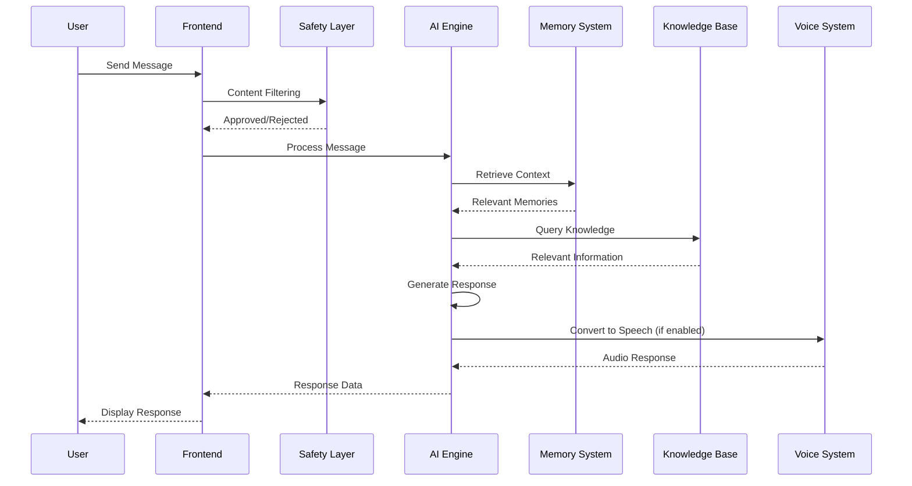
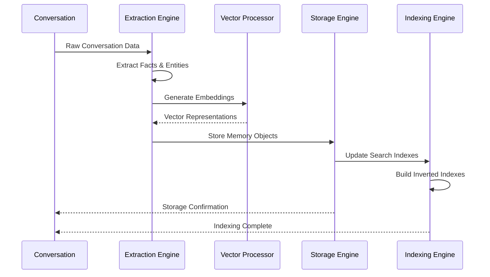

# 🏗️ AI Hive Mind Architecture

## Overview

The AI Hive Mind is a comprehensive multi-companion AI system built with modern web technologies, featuring advanced relationship dynamics, persistent memory, and multimodal interactions.

## Core Architecture Layers

### 🧠 AI & Personality Layer

#### Multi-Companion System



#### Personality Engine

Each AI companion has a unique personality profile:

```typescript
interface PersonalityProfile {
  name: string;
  traits: string[];
  communicationStyle: 'formal' | 'casual' | 'humorous' | 'serious';
  emotionalRange: number; // 0-1
  creativity: number; // 0-1
  empathy: number; // 0-1
  responsePatterns: ResponsePattern[];
}
```

### 🧬 Memory & Knowledge Layer

#### Memory Architecture



#### Knowledge Graph Structure

```typescript
interface KnowledgeNode {
  id: string;
  type: 'user' | 'ai' | 'concept' | 'event' | 'entity';
  properties: Record<string, any>;
  connections: KnowledgeEdge[];
}

interface KnowledgeEdge {
  from: string;
  to: string;
  relationship: string;
  strength: number;
  lastInteraction: Date;
}
```

### 💝 Relationship Evolution Layer

#### Relationship Progression System



#### Relationship Metrics

```typescript
interface RelationshipMetrics {
  interactionCount: number;
  averageResponseTime: number;
  emotionalAlignment: number; // How well emotions match
  topicDiversity: number; // Range of conversation topics
  consistencyScore: number; // Response predictability
  trustLevel: number; // Based on reliability
  intimacyLevel: number; // Depth of shared information
}
```

### 🎙️ Voice & Multimodal Layer

#### Voice Processing Pipeline



#### Multimodal Integration

```typescript
interface MultimodalMessage {
  text?: string;
  audio?: Blob;
  image?: File;
  location?: GeolocationCoordinates;
  timestamp: Date;
  metadata: {
    source: 'voice' | 'text' | 'image' | 'location';
    confidence: number;
    processingTime: number;
  };
}
```

### 🛡️ Safety & Moderation Layer

#### Content Filtering Pipeline



#### Safety Metrics

```typescript
interface SafetyMetrics {
  contentViolations: number;
  rateLimitHits: number;
  emotionalFlags: number;
  userWarnings: number;
  autoBlocks: number;
  manualReviews: number;
}
```

### 🔄 Offline & Synchronization Layer

#### Offline Architecture



#### Synchronization Strategy

```typescript
interface SyncOperation {
  type: 'create' | 'update' | 'delete';
  collection: 'conversations' | 'memories' | 'knowledge';
  data: any;
  timestamp: Date;
  priority: 'high' | 'medium' | 'low';
  retryCount: number;
}
```

## Data Flow Architecture

### Message Processing Flow



### Memory Formation Flow



## Component Architecture

### Frontend Architecture

```
src/
├── app/                    # Next.js App Router
│   ├── api/               # API Routes
│   ├── globals.css        # Global Styles
│   └── layout.tsx         # Root Layout
├── components/            # React Components
│   ├── ui/               # Reusable UI Components
│   ├── ChatLayout.tsx    # Main Chat Interface
│   ├── MemoryPanel.tsx   # Memory Visualization
│   └── AvatarPane.tsx    # Companion Avatars
├── lib/                  # Business Logic
│   ├── ai/              # AI Processing
│   ├── memory/          # Memory Management
│   ├── voice/           # Voice Processing
│   └── safety/          # Safety & Moderation
├── context/             # React Context
├── types/               # TypeScript Definitions
└── hooks/               # Custom React Hooks
```

### Backend Architecture

```
api/
├── chat/                # Chat Processing
├── memory/              # Memory Operations
├── character/           # AI Companion Management
├── voice/               # Voice Processing
├── knowledge/           # Knowledge Base
└── safety/              # Safety & Moderation
```

## Performance Considerations

### Caching Strategy

- **Memory Caching**: Frequently accessed data in IndexedDB
- **Response Caching**: AI responses for similar queries
- **Asset Caching**: Static resources with service worker

### Optimization Techniques

- **Lazy Loading**: Components loaded on demand
- **Code Splitting**: Bundle splitting for faster loads
- **Memory Management**: Automatic cleanup of old data
- **Background Processing**: Non-blocking operations

### Scalability Features

- **Horizontal Scaling**: Multiple AI instances
- **Load Balancing**: Distributed processing
- **Caching Layers**: Multi-level caching strategy
- **Database Sharding**: Data distribution for performance

## Security Architecture

### Authentication & Authorization

```typescript
interface AuthContext {
  user: User | null;
  session: Session;
  permissions: Permission[];
  securityLevel: 'basic' | 'premium' | 'admin';
}
```

### Data Protection

- **Encryption**: End-to-end encryption for sensitive data
- **Access Control**: Role-based permissions
- **Audit Logging**: Comprehensive activity tracking
- **Privacy Controls**: User data management

### API Security

- **Rate Limiting**: Request throttling per user
- **Input Validation**: Comprehensive data validation
- **CORS Configuration**: Cross-origin request handling
- **API Versioning**: Backward compatibility management

This architecture provides a robust, scalable, and secure foundation for the AI Hive Mind system, enabling rich multi-companion interactions with advanced AI capabilities.
