# 🌊 Data Flow Architecture

## Overview

This document visualizes and explains the data flow patterns within AI Hive Mind, showing how information moves through the system from user input to AI response and back.

## Core Data Flows

### 1. Message Processing Flow

```mermaid
graph TD
    A[User Types Message] --> B[ChatInput Component]
    B --> C[Input Validation]
    C --> D[Message Schema Validation]
    D --> E{Valid?}

    E -->|No| F[Show Error Message]
    E -->|Yes| G[Emit message_received Event]

    G --> H[Plugin System]
    H --> I[Pre-processing Plugins]
    I --> J[Message Enhancement]

    J --> K[Context Retrieval]
    K --> L[Memory System Query]
    L --> M[Vector Similarity Search]
    M --> N[Relevant Memories Retrieved]

    N --> O[AI Engine]
    O --> P[Prompt Construction]
    P --> Q[Personality Application]
    Q --> R[API Call to LLM]

    R --> S[Response Generation]
    S --> T[Response Validation]
    T --> U[Post-processing Plugins]

    U --> V[Memory Extraction]
    V --> W[New Memories Created]
    W --> X[Vector Embeddings Generated]
    X --> Y[Memory Storage]

    Y --> Z[Response Formatting]
    Z --> AA[Voice Synthesis (Optional)]
    AA --> BB[UI Update]
    BB --> CC[Message Displayed]
```

**Key Data Transformations**:

1. **Raw Input** → **Validated Message Object**
2. **Message** → **Enhanced Context** (with memories)
3. **Context** → **AI Prompt** (structured for LLM)
4. **AI Response** → **Structured Output** (with metadata)
5. **Response** → **UI Components** (formatted for display)

### 2. Memory Formation Flow

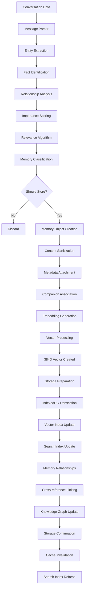

**Data Pipeline Stages**:

1. **Extraction**: Pull facts, entities, relationships from conversation
2. **Scoring**: Determine importance and retention priority
3. **Transformation**: Convert to structured memory objects
4. **Embedding**: Generate semantic vector representations
5. **Storage**: Persist with optimized indexing
6. **Linking**: Connect to existing knowledge graph

### 3. Voice Processing Flow

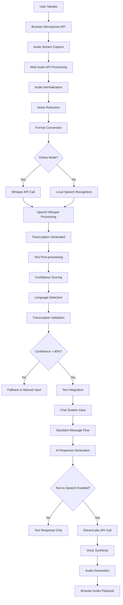

**Audio Data Journey**:

1. **Capture**: Raw audio from microphone
2. **Processing**: Normalization and enhancement
3. **Transcription**: Speech-to-text conversion
4. **Integration**: Text fed into chat system
5. **Synthesis**: AI response converted to speech
6. **Playback**: Audio output to user

## State Management Flow

### Application State Updates

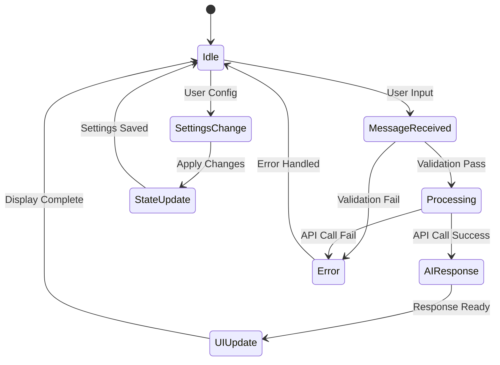

### Component Data Flow

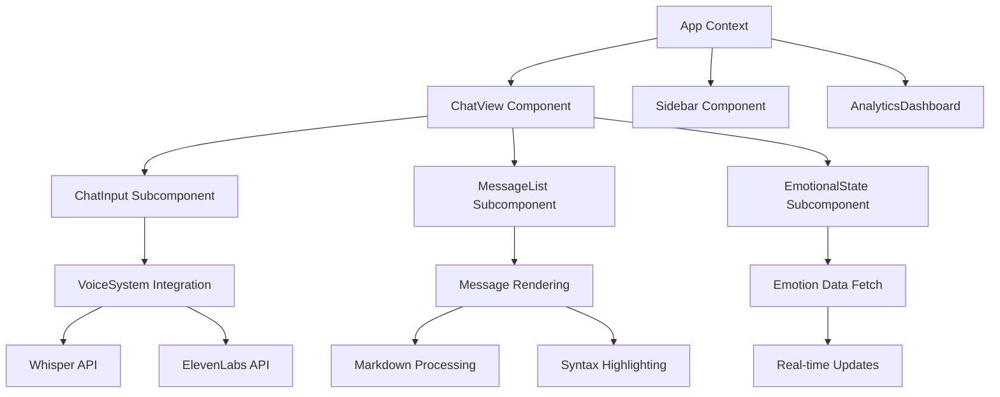

## API Data Flow

### REST API Request/Response Cycle

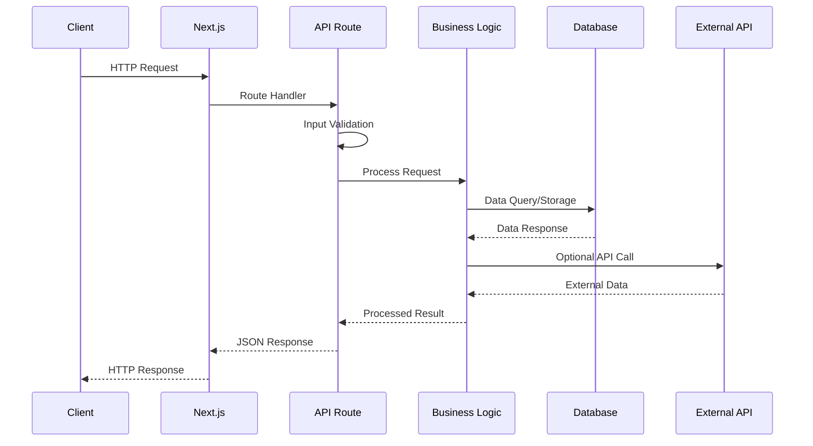

### Plugin System Data Flow

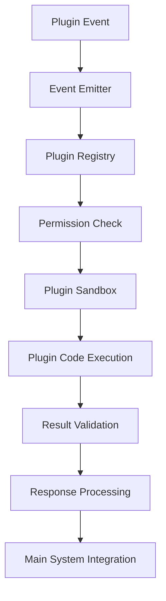

## Database Interaction Patterns

### Memory Storage Pattern

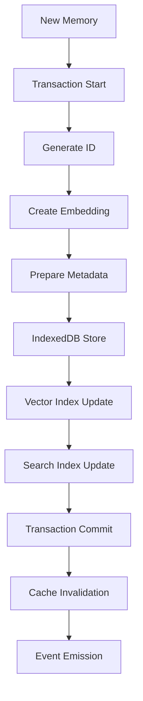

### Query Optimization Flow

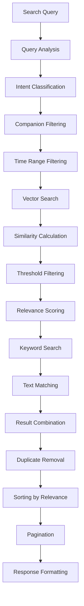

## Real-time Data Synchronization

### WebSocket Communication Flow

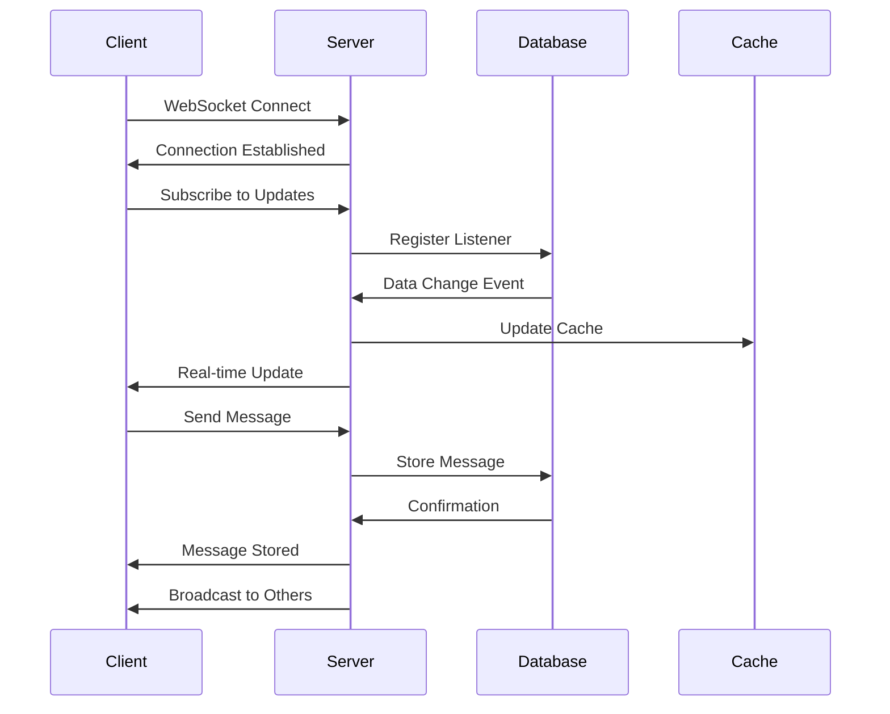

### Offline Synchronization

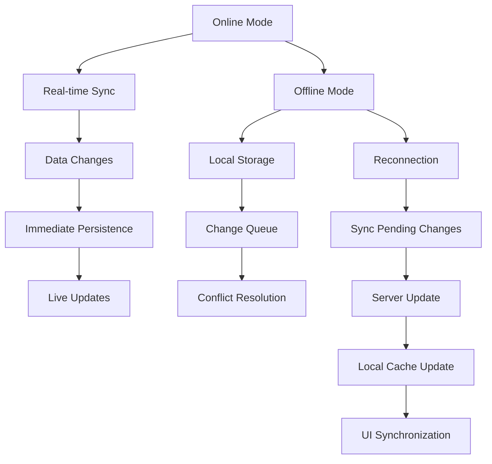

## Error Handling & Recovery

### Error Propagation Flow

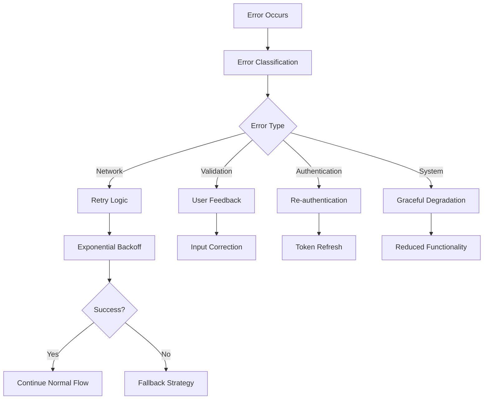

### Data Consistency Flow

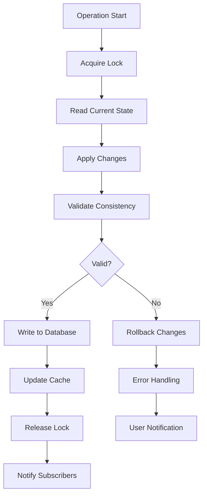

## Performance Monitoring

### Metrics Collection Flow

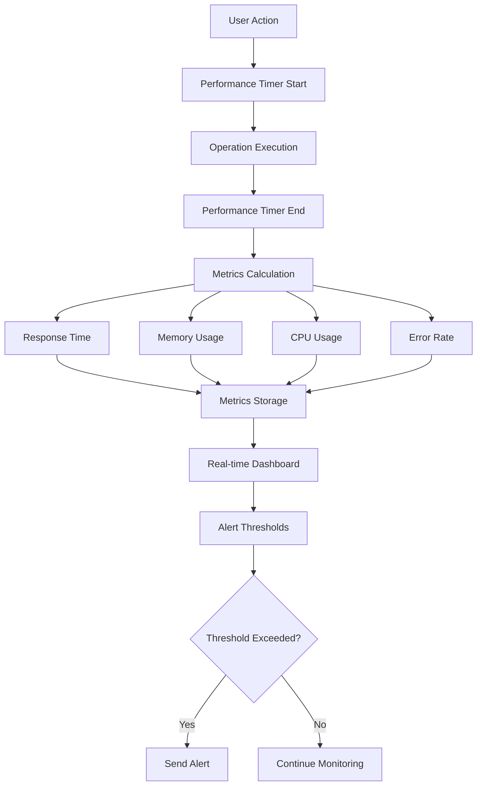

This data flow documentation provides a comprehensive view of how information moves through the AI Hive Mind system, enabling developers to understand the system's behavior and optimize performance.
